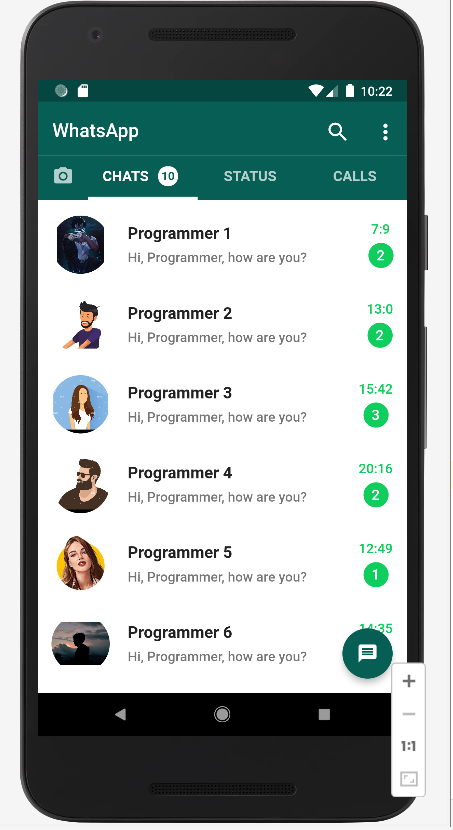
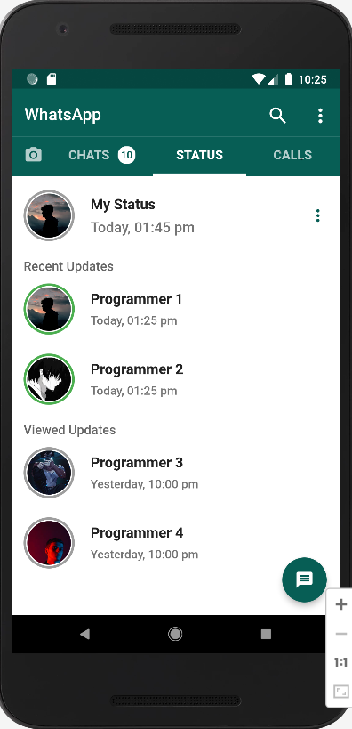
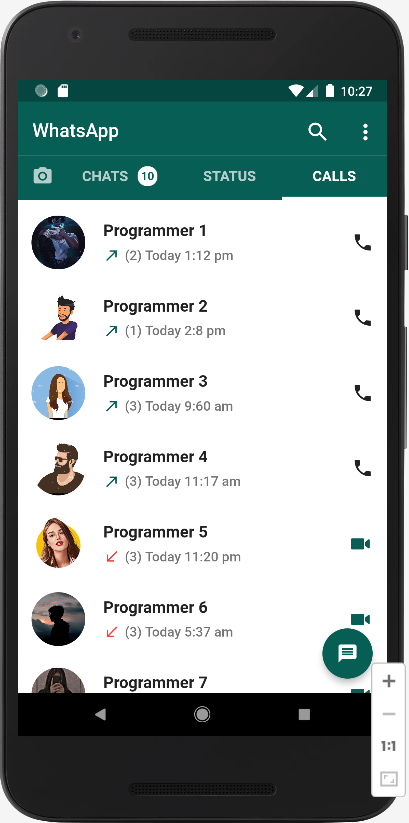
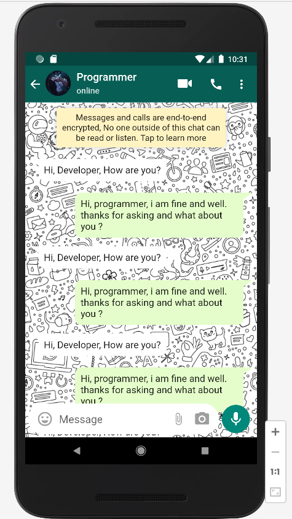
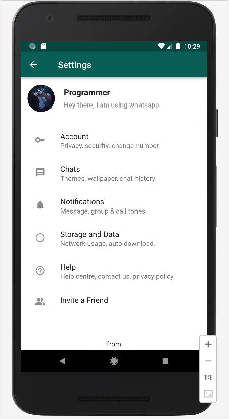

<h2><u>Report</u></h2>
<h3>WhatsApp Clone UI/UX Design Flutter   </h3>
<ul>
    

    <ol> </ol>
    <ol style="text-align: center"><strong style="color: red"> 1: </strong> Chats </ol>
    <ol> </ol>
    <ol style="text-align: center"><strong style="color: red">Figure 2: </strong> Status</ol>
    <ol> </ol>
    <ol style="text-align: center"><strong style="color: red">Figure 3: </strong> Calls</ol>
     <ol> </ol>
    <ol style="text-align: center"><strong style="color: red">Figure 4: </strong> Discussion</ol>
    <ol> </ol>
    <ol style="text-align: center"><strong style="color: red">Figure 4: </strong> Settings</ol>

</ul>

